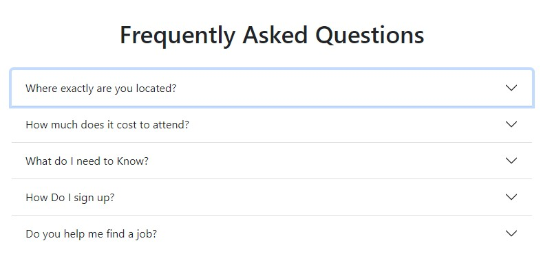
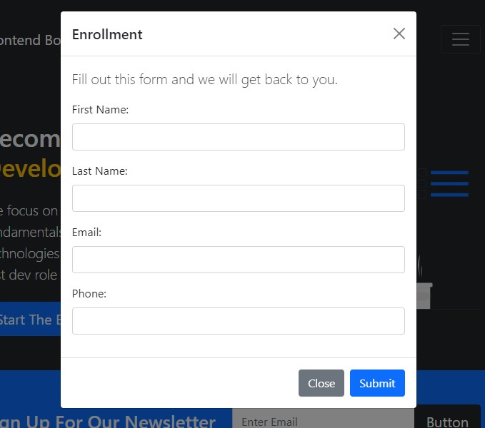

# Frontend Bootcamp Website - Bootstrap 5

> Simple one page website for a fake bootcamp

I picked the published project of a [YouTube tutorial](https://www.youtube.com/watch?v=4sosXZsdy-s&t=186s) and rebuilt it using the Bootstrap 5.0 documentation and icons.

The project helped me learn Bootstrap, often scouring through documentation for Bootstrap 5 looking for examples and exceptions responsible for the bugs I was facing. In all, I am happy with the result.

## Implementations
I had to implement a Modal that is seen when the Start Enrollment button is clicked, a Map showing our office location using the Mapbox API and an Accordion for the Frequently Asked Questions which initially shows only the questons but when clicked, the answer is in the dropdown section.

### Images

#### Live URL
Live Site : https://opeyimika-sudo.github.io/bootstrap-bootcamp-website/

